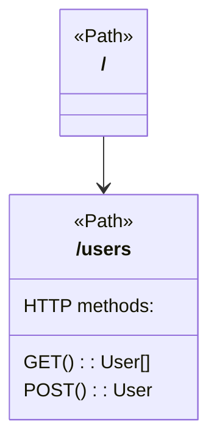

# UndineSpec

Generate Mermaid diagrams from OpenAPI specifications.

## Usage

```
npx ts-node bin/undinespec.ts <spec-file>
```

### Example

```
npx ts-node bin/undinespec.ts examples/sample.yaml
```

Output:


